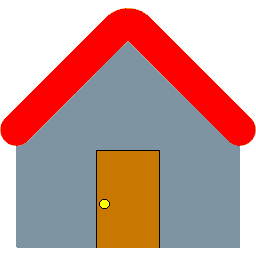

<div align="center" id="top"> 
  

  &#xa0;

  <!-- <a href="https://homepagepro.netlify.app">Preview</a> -->
  [Preview](https://pro-bandey.github.io/HomePage-Pro/)
</div>

<h1 align="center">HomePage Pro</h1>

<p align="center">
  <a href="#dart-about">About</a> &#xa0; | &#xa0; 
  <a href="#sparkles-features">Features</a> &#xa0; | &#xa0;
  <a href="#rocket-technologies">Technologies</a> &#xa0; | &#xa0;
  <a href="#white_check_mark-requirements">Requirements</a> &#xa0; | &#xa0;
  <a href="#checkered_flag-starting">Starting</a> &#xa0; | &#xa0;
  <a href="#memo-license">License</a> &#xa0; | &#xa0;
  <a href="https://github.com/Pro-Bandey" target="_blank">Author</a>
</p>

<hr>

<p align="center">

  

  

  

   

</p>

<!-- Status -->

<h4 align="center"> 
	🚧  HomePage Pro 🚀 Under construction...  🚧
</h4> 


<hr>

##  About ##

HomePage Pro is Pro versiovn of [HomePage](https://pro-bandey.github.io/HomePage/) our main aim is provide single place for every things that are are available on web seprately to every our users

<!-- ## Features ##

:heavy_check_mark: Feature 1;\
:heavy_check_mark: Feature 2;\
:heavy_check_mark: Feature 3; -->

##  Technologies ##

The following tools were used in this project:

- [Html](https://html.com/)
- [js](https://www.javascript.com/)
- [css](https://css.com/)
- [md](https://www.markdownguide.org/)
- [json](https://www.json.org/)

## Requirements ##

Before starting , you need to have [Git](https://git-scm.com) or [GitHubDeskTop](https://desktop.github.com/download/) and any [Text-Editor](https://www.google.com/search?q=text+editor) or [VS Codde](https://code.visualstudio.com/Download) installed. if new to it then use [GitHubDeskTop](https://desktop.github.com/download/) and [VS Codde](https://code.visualstudio.com/Download).

## Starting ##

```bash
# Clone this project
$ git clone https://github.com/Pro-Bandey/homepage-pro

# Access
$ cd homepage-pro

# Install dependencies
$ yarn

# Run the project
$ yarn start

# The server will initialize in the <http://localhost:3000>
```

## License ##

This project is under license from MIT. For more details, see the [LICENSE](LICENSE.md) file.


Made with 💓 by <a href="https://github.com/Pro-Bandey" target="_blank">Pro-Bandey</a>

&#xa0;

<a href="#top">Back to top</a>
